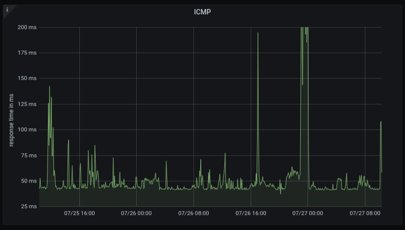

# `esphome-component-ping`

A `esphome` sensor component that sends and receives `ICMP`. It implements two
sensors: `loss` and `latency`. `loss` publishes packet loss rate of an ICMP
session, and `latency` publishes arithmetic mean of latencies in an ICMP
session.



This is my first attempt to learn `esphome` sensor component.

I have almost zero `C++` knowledge. You have been warned.

## Bugs

* the target must be IP address
* multiple targets are not supported

## Limitations

### The device sticks to weak `BSSID`

`esphome` does not implement roaming between WiFi APs (see [Issue 732](https://github.com/esphome/feature-requests/issues/731))
This means the device does not switch to better WiFi coverage, e.g. when the
closest AP is not available, the device connects to another AP available,
and will not switch to the closest one even when the closest AP is back
online again. This is often okay, but sometimes becomes an issue. The only
workaround is to reboot the device. Be sure to add [`restart` component](https://esphome.io/components/switch/restart.html)
to the device when you have multiple WiFi APs.

## Status

* Works on both `esp8266` and `esp32`
* the component works fine on `esp8266`. The longest uptime so far is more
  than 3 days.

## Requirements

* `python` 3.8
* `pipenv` (only if you do not have a working `esphome` installation)

## Usage

If you do not have a working `esphome`, install it. Or, install it with
[`pipenv`](https://pipenv.pypa.io/en/latest/).

```console
pipenv install
```

Run your shell in the python virtual environment.

```console
pipenv shell
```

Copy `secrets.yaml`. You probably want to modify it, i.e. password, `SSID`,
etc.

```console
cp config/secrets.yaml.dist config/secrets.yaml
```

Compile `ping.yaml` in the python virtual environment.

```console
esphome compile config/ping.yaml
```

## Usage in your project

See [External Components](https://esphome.io/components/external_components.html).

### With `local`

Create `components` directory in your project root.

```console
mkdir components
```

Clone, or `submodule`, the repository in the `components` directory.

```console
cd components
git clone https://github.com/trombik/esphome-component-ping.git
```

In the configuration file, set `path` in `external_components`.

```yaml
external_components:
  - source:
      type: local
      path: ../components/esphome-component-ping/components
```

### With `git`

Add `external_components` to the configuration file. `ref` should be git `ref`;
tag, branch, or commit.

```yaml
external_components:
  - source:
      type: git
      path: https://github.com/trombik/esphome-component-ping
      ref: main
```

## Example

See [config/ping.yaml](config/ping.yaml).

If you want to take actions on sensor values, see [config/influxdb.yaml](config/influxdb.yaml).
In the example, `on_value` runs an automation (sending the value to `influxdb`
whenever a value is available). Use
`on_value_range` ([the documentation](https://esphome.io/components/sensor/index.html#on-value-range)
when the sensor value is above, below, or both.

## Log

### `esp8266`

```console
INFO Reading configuration config/ping.yaml...
INFO Starting log output from ping.local using esphome API
INFO Connecting to ping.local:6053 (192.168.99.16)
INFO Successfully connected to ping.local
[18:30:54][I][app:105]: ESPHome version 1.19.4 compiled on Jul 19 2021, 17:42:16
[18:30:54][C][wifi:484]: WiFi:
[18:30:54][C][wifi:344]:   SSID: [redacted]
[18:30:54][C][wifi:345]:   IP Address: 192.168.99.16
[18:30:54][C][wifi:347]:   BSSID: [redacted]
[18:30:54][C][wifi:348]:   Hostname: 'ping'
[18:30:54][C][wifi:352]:   Signal strength: -60 dB ▂▄▆█
[18:30:54][C][wifi:356]:   Channel: 1
[18:30:54][C][wifi:357]:   Subnet: 255.255.255.0
[18:30:54][C][wifi:358]:   Gateway: 192.168.99.254
[18:30:54][C][wifi:359]:   DNS1: 192.168.99.251
[18:30:54][C][wifi:360]:   DNS2: (IP unset)
[18:30:54][C][logger:189]: Logger:
[18:30:54][C][logger:190]:   Level: DEBUG
[18:30:54][C][logger:191]:   Log Baud Rate: 115200
[18:30:54][C][logger:192]:   Hardware UART: UART0
[18:30:54][C][captive_portal:148]: Captive Portal:
[18:30:54][C][web_server:136]: Web Server:
[18:30:54][C][web_server:137]:   Address: ping.local:80
[18:30:54][C][ota:029]: Over-The-Air Updates:
[18:30:54][C][ota:030]:   Address: ping.local:8266
[18:30:54][C][ota:032]:   Using Password.
[18:30:55][C][api:095]: API Server:
[18:30:55][C][api:096]:   Address: ping.local:6053
[18:31:20][D][sensor:117]: 'Packet loss': Sending state 0.00000 % with 0 decimals of accuracy
[18:31:20][D][sensor:117]: 'Latency': Sending state 41.00000 ms with 0 decimals of accuracy
[18:31:20][I][ping:037]: 64 bytes from 156.154.100.3: icmp_seq=1 ttl=55 time=48 ms
[18:31:21][I][ping:037]: 64 bytes from 156.154.100.3: icmp_seq=2 ttl=55 time=39 ms
[18:31:22][I][ping:037]: 64 bytes from 156.154.100.3: icmp_seq=3 ttl=55 time=40 ms
[18:31:23][I][ping:037]: 64 bytes from 156.154.100.3: icmp_seq=4 ttl=55 time=43 ms
[18:31:24][I][ping:037]: 64 bytes from 156.154.100.3: icmp_seq=5 ttl=55 time=41 ms
[18:31:25][I][ping:037]: 64 bytes from 156.154.100.3: icmp_seq=6 ttl=55 time=39 ms
[18:31:26][I][ping:037]: 64 bytes from 156.154.100.3: icmp_seq=7 ttl=55 time=40 ms
[18:31:27][I][ping:037]: 64 bytes from 156.154.100.3: icmp_seq=8 ttl=55 time=39 ms
[18:31:28][I][ping:037]: 64 bytes from 156.154.100.3: icmp_seq=9 ttl=55 time=39 ms
[18:31:29][I][ping:037]: 64 bytes from 156.154.100.3: icmp_seq=10 ttl=55 time=41 ms
[18:31:30][I][ping:037]: 64 bytes from 156.154.100.3: icmp_seq=11 ttl=55 time=39 ms
[18:31:31][I][ping:037]: 64 bytes from 156.154.100.3: icmp_seq=12 ttl=55 time=43 ms
[18:31:32][I][ping:037]: 64 bytes from 156.154.100.3: icmp_seq=13 ttl=55 time=41 ms
[18:31:33][I][ping:063]: packet loss: 0.0 % latency: 40 ms
```

### `esp32`

```console
[C][logger:189]: Logger:
[C][logger:190]:   Level: DEBUG
[C][logger:191]:   Log Baud Rate: 115200
[C][logger:192]:   Hardware UART: UART0
[C][captive_portal:148]: Captive Portal:
[C][web_server:136]: Web Server:
[C][web_server:137]:   Address: ping_sensor.local:80
[C][ota:029]: Over-The-Air Updates:
[C][ota:030]:   Address: ping_sensor.local:3232
[C][ota:032]:   Using Password.
[I][ping_esp32:063]: 64 bytes from 8.8.8.8 icmp_seq=1 ttl=117 time=448 ms
[I][ping_esp32:063]: 64 bytes from 8.8.8.8 icmp_seq=2 ttl=117 time=42 ms
[I][ping_esp32:063]: 64 bytes from 8.8.8.8 icmp_seq=3 ttl=117 time=42 ms
[I][ping_esp32:063]: 64 bytes from 8.8.8.8 icmp_seq=4 ttl=117 time=39 ms
[I][ping_esp32:063]: 64 bytes from 8.8.8.8 icmp_seq=5 ttl=117 time=41 ms
[I][ping_esp32:063]: 64 bytes from 8.8.8.8 icmp_seq=6 ttl=117 time=40 ms
[I][ping_esp32:063]: 64 bytes from 8.8.8.8 icmp_seq=7 ttl=117 time=40 ms
[I][ping_esp32:063]: 64 bytes from 8.8.8.8 icmp_seq=8 ttl=117 time=43 ms
[I][ping_esp32:063]: 64 bytes from 8.8.8.8 icmp_seq=9 ttl=117 time=40 ms
[I][ping_esp32:063]: 64 bytes from 8.8.8.8 icmp_seq=10 ttl=117 time=41 ms
[I][ping_esp32:063]: 64 bytes from 8.8.8.8 icmp_seq=11 ttl=117 time=42 ms
[I][ping_esp32:063]: 64 bytes from 8.8.8.8 icmp_seq=12 ttl=117 time=42 ms
[I][ping_esp32:063]: 64 bytes from 8.8.8.8 icmp_seq=13 ttl=117 time=45 ms
[I][ping_esp32:063]: 64 bytes from 8.8.8.8 icmp_seq=14 ttl=117 time=43 ms
[I][ping_esp32:063]: 64 bytes from 8.8.8.8 icmp_seq=15 ttl=117 time=40 ms
[I][ping_esp32:102]: From 8.8.8.8 icmp_seq=16 timeout
[I][ping_esp32:102]: From 8.8.8.8 icmp_seq=17 timeout
[I][ping_esp32:084]: --- 8.8.8.8 ping statistics ---
[I][ping_esp32:089]: 17 packets transmitted, 15 received, 11% packet loss, total time 3028ms avg time 68ms
[D][sensor:117]: 'Packet loss': Sending state 11.00000 % with 0 decimals of accuracy
[D][sensor:117]: 'Latency': Sending state 0.06800 s with 3 decimals of accuracy
```
